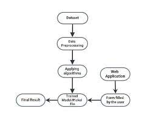

---

# AI Predictive Models for Credit Underwriting

This project leverages machine learning to automate loan eligibility assessments based on applicant details, financial history, and loan attributes. It includes feature importance analysis, model training, and both a Flask API and a Streamlit web application for real-time predictions.

## Table of Contents

1. [Introduction](#introduction)  
2. [Features](#features)  
3. [Technologies Used](#technologies-used)  
4. [Dataset](#dataset)  
5. [Model and Approach](#model-and-approach)  
6. [Web Application](#web-application)  
7. [Flask API](#flask-api)  
8. [Installation](#installation)  
9. [Usage](#usage)  
10. [Results](#results)  
11. [Future Enhancements](#future-enhancements)  
12. [Learning Resources](#learning-resources)
13. [License](#license)  

## Introduction

Loan approval decisions are critical for financial institutions. This project automates the assessment process using machine learning, providing quick and accurate predictions to aid lenders in minimizing risks and improving efficiency.

## Features

- **Predictive Modeling**: Uses a Light Gradient Boosting model to predict loan approval (approx 93% accuracy, approx 82% F1-score).
- **Real-Time Predictions**: Offers predictions via both a Flask API and a Streamlit web application.
- **Feature Importance Analysis**: Highlights key factors influencing loan approval decisions.
- **Robust Input Handling**: Manages missing or invalid inputs effectively.

## Technologies Used

- **Programming Language**: Python
- **Libraries**:
  - **Machine Learning**: `scikit-learn`, `numpy`, `pandas`, `lightgbm`
  - **Visualization**: `matplotlib`, `seaborn`
  - **Web Application**: `streamlit`, `flask`
- **Deployment**: Docker, Gunicorn, Nginx

## Dataset

- **Source**: [Dataset Source](#)
- **Attributes**:
  - **Demographic**: `person_age`, `person_income`, `person_emp_length`, `person_home_ownership`
  - **Loan Details**: `loan_amnt`, `loan_int_rate`, `loan_intent`, `loan_grade`
  - **Credit History**: `cb_person_cred_hist_length`, `cb_person_default_on_file`
- Categorical attributes are one-hot encoded for machine learning compatibility.

## Model and Approach

1. **Data Preprocessing**:
   - Handled missing values and encoded categorical features.
   - Scaled numerical features for consistent model input.

2. **Model**:
   - Trained using multiple classification algorithms, including Logistic Regression, SVC, Random Forest, AdaBoost, CatBoost, LightGBM, and Gradient Boosting.
   - **Final Model**: Light Gradient Boosting (LightGBM) was selected for its high accuracy and interpretability.

3. **Evaluation**:
   - Metrics: Accuracy, Precision, Recall, F1-Score.
   - LightGBM achieved approximately 93% accuracy and 82% F1-score.

4. **Deployment**:
   - Streamlit-based app for user-friendly predictions.
   - Flask API for integration with other applications.

## Web Application

The Streamlit web application allows users to input loan details and view predictions.

### Key Features:
- Intuitive form-based input for loan attributes.
- Instant predictions with explanations.

### Live Demo:
[AI Predictive Models for Credit Underwriting - Streamlit App](https://jatinsharma496-ai-predictive-models-for-credit-under-app-vbp9fd.streamlit.app/)

## Flask API

The Flask API provides endpoints for integrating the loan prediction model into other applications.

### Key Features:
- POST endpoint to receive loan details and return predictions.
- Handles JSON input and output.
- Error handling for invalid inputs.

### Example Request:

```bash
curl -X POST -H "Content-Type: application/json" -d '{
    "person_age": 21,
    "person_income": 9600,
    "person_home_ownership": "OWN",
    "person_emp_length": 5.0,
    "loan_intent": "EDUCATION",
    "loan_grade": "B",
    "loan_amnt": 1000,
    "loan_int_rate": 11.02,
    "cb_person_default_on_file": "N",
    "cb_person_cred_hist_length": 3
}' http://localhost:5000/predict
```

### Example Response:

```json
{
  "prediction": "Approved"
}
```

## Installation

1. **Clone the Repository**:

   ```bash
   git clone https://github.com/JatinSharma496/AI_Predictive_Models_for_Credit_Underwriting.git
   cd AI_Predictive_Models_for_Credit_Underwriting
   ```

2. **Set Up Virtual Environment**:

   ```bash
   python -m venv venv
   source venv/bin/activate  # On Windows: venv\Scripts\activate
   ```

3. **Install Dependencies**:

   ```bash
   pip install -r requirements.txt
   ```

4. **Run the Flask API**:

   ```bash
   python app.py
   ```

5. **Run the Streamlit App**:

   ```bash
   streamlit run app.py
   ```

## Usage

- **Flask API**: Send POST requests to `http://localhost:5000/predict` with loan details in JSON format or use Postman.
- **Streamlit App**: Navigate to `http://localhost:8501` in your browser to input loan details and receive predictions.

## Results

The model demonstrates high accuracy in predicting loan approvals, with feature importance analysis highlighting key factors such as `person_income` and `loan_amnt`.




## Future Enhancements

- Integrate additional data sources for improved predictions.
- Implement user authentication for the web application.

## Learning Resources:

- [YouTube Playlist on Machine Learning](https://youtube.com/playlist?list=PLKnIA16_Rmvbr7zKYQuBfsVkjoLcJgxHH&si=QWJRhsnFwu6etoRT)
- [GeeksforGeeks - LightGBM](https://www.geeksforgeeks.org/lightgbm-light-gradient-boosting-machine/)
- [Kaggle Learn Courses](https://www.kaggle.com/learn)
---
## License:
 - This project is licensed under the MIT License - see the [LICENSE](https://github.com/JatinSharma496/AI_Predictive_Models_for_Credit_Underwriting/blob/main/LICENSE) file for details.

Thank you for reading! If you like my project, feel free to give a ⭐ on GitHub!

---
